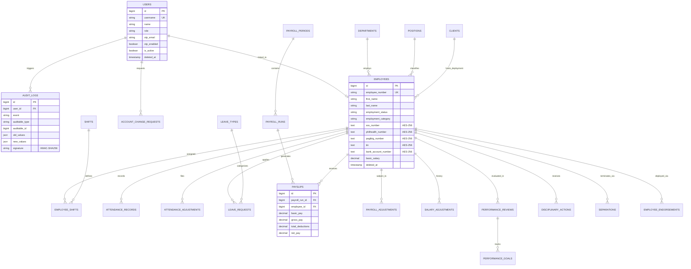

# PrimePower HRIS — Comprehensive Data Dictionary & Database Architecture

## 1. Architectural Overview

The **PrimePower Human Resource Information System (HRIS)** database architecture is engineered on **PostgreSQL** relational foundations, designed for strict data integrity, auditability, and regulatory compliance under the **Philippine Data Privacy Act of 2012 (RA 10173)**.

### Core Architecture Pillars:
- **Field-Level Cryptography (AES-256-CBC)**: Personally Identifiable Information (PII) including government identifiers (SSS, PhilHealth, Pag-IBIG, TIN) and sensitive banking account numbers are encrypted at rest using Laravel's OpenSSL-backed cryptographic provider (`APP_KEY`). Plaintext values never exist in disk blocks or automated dumps.
- **Tamper-Evident Audit Trail (HMAC-SHA256)**: Every record mutation and data export produces an immutable `audit_logs` record cryptographically signed with a SHA-256 HMAC digest using the application master secret. Any direct SQL manipulation invalidates the signature and is surfaced immediately by `audit:verify`.
- **Soft Deletion & Non-Destructive Archiving**: Critical workforce and user records implement soft deletion (`deleted_at`). Terminated or archived profiles are isolated from active directory operations while preserving historical integrity for payroll and compliance reporting.
- **Foreign Key Indexing & Cascade Policies**: All foreign keys maintain explicit indexes to prevent table locks and table scans during high-throughput payroll processing. Cascade rules are restricted (`restrict` / `set null`) to avoid accidental cascade deletions of payroll or compliance histories.

---

## 2. Entity-Relationship (ER) Diagram

---

## 3. Data Dictionary

### 3.1. Authentication & System Governance

#### `users`
Primary authentication, RBAC accounts, and multi-factor credentials.

| Field Name | Type | Nullable | Key | Default | Description |
| :--- | :--- | :--- | :--- | :--- | :--- |
| `id` | `bigint unsigned` | NO | PK | Auto-inc | Unique user identifier |
| `name` | `varchar(255)` | NO | | | Full display name |
| `username` | `varchar(255)` | NO | UK | | Corporate login username (`user@primepower.com`) |
| `password` | `varchar(255)` | NO | | | Bcrypt password hash |
| `role` | `varchar(50)` | NO | | `'employee'` | RBAC Role (`super_admin`, `admin`, `hr_staff`, `supervisor`, `employee`) |
| `otp_email` | `varchar(255)` | YES | | NULL | Destination email for OTP 2FA login verification |
| `otp_code` | `varchar(255)` | YES | | NULL | Hashed 6-digit numeric MFA OTP token |
| `otp_expires_at` | `timestamp` | YES | | NULL | Expiration timestamp for MFA OTP challenge |
| `otp_enabled` | `boolean` | NO | | `false` | Whether OTP 2FA is strictly enforced |
| `is_active` | `boolean` | NO | | `true` | Account active state |
| `must_change_password` | `boolean` | NO | | `false` | First-time login / administrative reset flag |
| `remember_token` | `varchar(100)` | YES | | NULL | Web session persistence token |
| `created_at` | `timestamp` | YES | | NULL | Record creation timestamp |
| `updated_at` | `timestamp` | YES | | NULL | Record last update timestamp |
| `deleted_at` | `timestamp` | YES | | NULL | Soft delete archival timestamp |

#### `audit_logs`
Cryptographically signed, immutable audit trail of all system events.

| Field Name | Type | Nullable | Key | Default | Description |
| :--- | :--- | :--- | :--- | :--- | :--- |
| `id` | `bigint unsigned` | NO | PK | Auto-inc | Unique audit log ID |
| `user_id` | `bigint unsigned` | YES | FK | NULL | Operating user ID (`users.id`) |
| `impersonated_by` | `bigint unsigned` | YES | FK | NULL | Administrator ID if action was performed via impersonation |
| `auditable_type` | `varchar(255)` | YES | | NULL | Target Eloquent model class |
| `auditable_id` | `bigint unsigned` | YES | | NULL | Target model primary key |
| `event` | `varchar(100)` | NO | | | Action verb (`created`, `updated`, `deleted`, `exported`, `login`) |
| `old_values` | `json` | YES | | NULL | Pre-mutation field values snapshot |
| `new_values` | `json` | YES | | NULL | Post-mutation field values snapshot |
| `ip_address` | `varchar(45)` | YES | | NULL | Client IPv4 / IPv6 address |
| `user_agent` | `text` | YES | | NULL | Client browser User-Agent string |
| `signature` | `varchar(64)` | YES | | NULL | HMAC-SHA256 tamper-evident integrity hash |
| `created_at` | `timestamp` | YES | | NULL | Creation timestamp |
| `updated_at` | `timestamp` | YES | | NULL | Update timestamp |

---

### 3.2. Organizational Structure & Clients

#### `departments`
Company operating departments and cost centers.

| Field Name | Type | Nullable | Key | Default | Description |
| :--- | :--- | :--- | :--- | :--- | :--- |
| `id` | `bigint unsigned` | NO | PK | Auto-inc | Primary key |
| `code` | `varchar(50)` | NO | UK | | Department code (e.g. `HR`, `OPS`, `FIN`) |
| `name` | `varchar(255)` | NO | | | Full department name |
| `manager_id` | `bigint unsigned` | YES | FK | NULL | Department head (`employees.id`) |
| `created_at` | `timestamp` | YES | | NULL | Creation timestamp |
| `updated_at` | `timestamp` | YES | | NULL | Update timestamp |

#### `positions`
Job roles, titles, and structural ranks.

| Field Name | Type | Nullable | Key | Default | Description |
| :--- | :--- | :--- | :--- | :--- | :--- |
| `id` | `bigint unsigned` | NO | PK | Auto-inc | Primary key |
| `code` | `varchar(50)` | NO | UK | | Position code |
| `title` | `varchar(255)` | NO | | | Job title |
| `department_id` | `bigint unsigned` | YES | FK | NULL | Assigned department (`departments.id`) |
| `salary_grade` | `integer` | YES | | NULL | Base salary grade level |
| `created_at` | `timestamp` | YES | | NULL | Creation timestamp |
| `updated_at` | `timestamp` | YES | | NULL | Update timestamp |

#### `clients`
External corporate client organizations for deployed manpower.

| Field Name | Type | Nullable | Key | Default | Description |
| :--- | :--- | :--- | :--- | :--- | :--- |
| `id` | `bigint unsigned` | NO | PK | Auto-inc | Primary key |
| `code` | `varchar(50)` | NO | UK | | Client code |
| `name` | `varchar(255)` | NO | | | Corporate client name |
| `contact_person` | `varchar(255)` | YES | | NULL | Client liaison officer |
| `contact_email` | `varchar(255)` | YES | | NULL | Contact email |
| `contact_number` | `varchar(50)` | YES | | NULL | Phone number |
| `billing_address` | `text` | YES | | NULL | Official billing address |
| `is_active` | `boolean` | NO | | `true` | Active partnership status |
| `created_at` | `timestamp` | YES | | NULL | Creation timestamp |
| `updated_at` | `timestamp` | YES | | NULL | Update timestamp |
| `deleted_at` | `timestamp` | YES | | NULL | Soft delete timestamp |

---

### 3.3. Employee Master Profile (201 File)

#### `employees`
Core employee master records with encrypted PII.

| Field Name | Type | Nullable | Key | Default | Security / Encryption | Description |
| :--- | :--- | :--- | :--- | :--- | :--- | :--- |
| `id` | `bigint unsigned` | NO | PK | Auto-inc | Standard | Unique employee record ID |
| `user_id` | `bigint unsigned` | YES | FK | NULL | Standard | Linked login user account (`users.id`) |
| `employee_number` | `varchar(50)` | NO | UK | | Standard | Unique corporate ID (e.g. `EMP-2026-001`) |
| `first_name` | `varchar(100)` | NO | | | Standard | Legal first name |
| `middle_name` | `varchar(100)` | YES | | NULL | Standard | Legal middle name |
| `last_name` | `varchar(100)` | NO | | | Standard | Legal last name |
| `suffix` | `varchar(20)` | YES | | NULL | Standard | Name suffix (Jr., III, etc.) |
| `department_id` | `bigint unsigned` | YES | FK | NULL | Standard | Assigned department |
| `position_id` | `bigint unsigned` | YES | FK | NULL | Standard | Assigned position |
| `client_id` | `bigint unsigned` | YES | FK | NULL | Standard | Deployed client organization |
| `supervisor_id` | `bigint unsigned` | YES | FK | NULL | Standard | Direct reporting line (`employees.id`) |
| `employment_status` | `varchar(50)` | NO | | `'probationary'` | Standard | `regular`, `probationary`, `contractual`, `project_based`, `resigned`, `terminated` |
| `employment_category` | `varchar(50)` | NO | | `'internal'` | Standard | `internal` (head office) or `external` (deployed client manpower) |
| `status` | `varchar(50)` | NO | | `'active'` | Standard | Record lifecycle status |
| `date_hired` | `date` | NO | | | Standard | Official date of hire |
| `birthdate` | `date` | YES | | NULL | Standard | Date of birth |
| `gender` | `varchar(20)` | YES | | NULL | Standard | Gender identity |
| `civil_status` | `varchar(30)` | YES | | NULL | Standard | Single, Married, Widowed, Separated |
| `email` | `varchar(255)` | YES | | NULL | Standard | Personal email address |
| `mobile_number` | `varchar(50)` | YES | | NULL | Standard | Mobile contact number |
| `sss_number` | `text` | YES | | NULL | **AES-256-CBC Encrypted** | Social Security System number |
| `philhealth_number` | `text` | YES | | NULL | **AES-256-CBC Encrypted** | PhilHealth identification number |
| `pagibig_number` | `text` | YES | | NULL | **AES-256-CBC Encrypted** | Pag-IBIG / HDMF MID number |
| `tin` | `text` | YES | | NULL | **AES-256-CBC Encrypted** | Tax Identification Number (BIR) |
| `bank_name` | `varchar(100)` | YES | | NULL | Standard | Payroll disbursement bank |
| `bank_account_number` | `text` | YES | | NULL | **AES-256-CBC Encrypted** | Payroll bank account / card number |
| `basic_salary` | `decimal(12,2)` | NO | | `0.00` | Standard | Current active monthly basic wage (PHP) |
| `created_at` | `timestamp` | YES | | NULL | Standard | Creation timestamp |
| `updated_at` | `timestamp` | YES | | NULL | Standard | Update timestamp |
| `deleted_at` | `timestamp` | YES | | NULL | Soft Delete | Archive timestamp |

---

### 3.4. Timekeeping & Attendance

#### `shifts`
Work schedule definitions, grace periods, and break policies.

| Field Name | Type | Nullable | Key | Default | Description |
| :--- | :--- | :--- | :--- | :--- | :--- |
| `id` | `bigint unsigned` | NO | PK | Auto-inc | Shift ID |
| `code` | `varchar(50)` | NO | UK | | Shift identifier (`DAY`, `NIGHT`, `GRAVE`) |
| `name` | `varchar(255)` | NO | | | Descriptive shift label |
| `start_time` | `time` | NO | | | Scheduled start time |
| `end_time` | `time` | NO | | | Scheduled end time |
| `break_minutes` | `integer` | NO | | `60` | Unpaid meal break duration |
| `grace_minutes` | `integer` | NO | | `15` | Tardy threshold grace period |
| `is_active` | `boolean` | NO | | `true` | Shift active state |

#### `attendance_records`
Daily employee time entries, hours worked, late, overtime, and undertime.

| Field Name | Type | Nullable | Key | Default | Description |
| :--- | :--- | :--- | :--- | :--- | :--- |
| `id` | `bigint unsigned` | NO | PK | Auto-inc | Primary key |
| `employee_id` | `bigint unsigned` | NO | FK | | Employee reference |
| `date` | `date` | NO | | | Attendance calendar date |
| `time_in` | `datetime` | YES | | NULL | Actual punch-in timestamp |
| `time_out` | `datetime` | YES | | NULL | Actual punch-out timestamp |
| `hours_worked` | `decimal(5,2)` | NO | | `0.00` | Regular hours rendered |
| `overtime_hours` | `decimal(5,2)` | NO | | `0.00` | Authorized overtime hours |
| `late_minutes` | `integer` | NO | | `0` | Tardy minutes past grace threshold |
| `undertime_minutes` | `integer` | NO | | `0` | Minutes departed before shift end |
| `status` | `varchar(50)` | NO | | `'present'` | `present`, `absent`, `rest_day`, `on_leave`, `holiday` |

---

### 3.5. Leave Administration

#### `leave_types`
Statutory and company-provided leave categories.

| Field Name | Type | Nullable | Key | Default | Description |
| :--- | :--- | :--- | :--- | :--- | :--- |
| `id` | `bigint unsigned` | NO | PK | Auto-inc | Primary key |
| `code` | `varchar(50)` | NO | UK | | Leave code (`VL`, `SL`, `EL`, `ML`, `PL`) |
| `name` | `varchar(255)` | NO | | | Vacation, Sick, Emergency, Maternity |
| `days_per_year` | `integer` | NO | | `15` | Default annual allocation |
| `is_paid` | `boolean` | NO | | `true` | Whether leave is compensated |

#### `leave_requests`
Employee leave applications and approval workflows.

| Field Name | Type | Nullable | Key | Default | Description |
| :--- | :--- | :--- | :--- | :--- | :--- |
| `id` | `bigint unsigned` | NO | PK | Auto-inc | Primary key |
| `employee_id` | `bigint unsigned` | NO | FK | | Applicant employee |
| `leave_type_id` | `bigint unsigned` | NO | FK | | Requested leave type |
| `start_date` | `date` | NO | | | First leave day |
| `end_date` | `date` | NO | | | Last leave day |
| `days_count` | `decimal(4,1)` | NO | | `1.0` | Number of working days requested |
| `reason` | `text` | NO | | | Justification notes |
| `status` | `varchar(50)` | NO | | `'pending'` | `pending`, `approved`, `rejected`, `cancelled` |
| `approved_by` | `bigint unsigned` | YES | FK | NULL | Approving supervisor or HR user ID |
| `action_reason` | `text` | YES | | NULL | Rejection / approval commentary |

---

### 3.6. Payroll & Compensation

#### `payroll_periods`
Semi-monthly or monthly cut-off calendar cycles.

| Field Name | Type | Nullable | Key | Default | Description |
| :--- | :--- | :--- | :--- | :--- | :--- |
| `id` | `bigint unsigned` | NO | PK | Auto-inc | Primary key |
| `name` | `varchar(100)` | NO | | | E.g. "Sep 1 – Sep 15, 2026" |
| `start_date` | `date` | NO | | | Cut-off start date |
| `end_date` | `date` | NO | | | Cut-off end date |
| `pay_date` | `date` | NO | | | Scheduled salary release date |
| `frequency` | `varchar(50)` | NO | | `'semi_monthly'` | `semi_monthly`, `monthly`, `weekly` |
| `status` | `varchar(50)` | NO | | `'draft'` | `draft`, `processing`, `approved`, `paid` |

#### `payslips`
Individual employee wage breakdown, statutory contributions, and net payouts.

| Field Name | Type | Nullable | Key | Default | Description |
| :--- | :--- | :--- | :--- | :--- | :--- |
| `id` | `bigint unsigned` | NO | PK | Auto-inc | Primary key |
| `payroll_run_id` | `bigint unsigned` | NO | FK | | Parent payroll batch run |
| `employee_id` | `bigint unsigned` | NO | FK | | Receiving employee |
| `basic_pay` | `decimal(12,2)` | NO | | `0.00` | Pro-rated basic pay for cut-off |
| `overtime_pay` | `decimal(12,2)` | NO | | `0.00` | Overtime, night diff, holiday premiums |
| `allowances` | `decimal(12,2)` | NO | | `0.00` | Taxable and non-taxable allowances |
| `gross_pay` | `decimal(12,2)` | NO | | `0.00` | Total earnings |
| `sss_employee` | `decimal(12,2)` | NO | | `0.00` | SSS employee statutory share |
| `philhealth_employee` | `decimal(12,2)` | NO | | `0.00` | PhilHealth employee statutory share |
| `pagibig_employee` | `decimal(12,2)` | NO | | `0.00` | Pag-IBIG employee statutory share |
| `withholding_tax` | `decimal(12,2)` | NO | | `0.00` | BIR withholding tax |
| `other_deductions` | `decimal(12,2)` | NO | | `0.00` | Loans, tardiness, undertime |
| `total_deductions` | `decimal(12,2)` | NO | | `0.00` | Total subtractions |
| `net_pay` | `decimal(12,2)` | NO | | `0.00` | Net take-home payout |
| `is_released` | `boolean` | NO | | `false` | Payslip visibility to employee portal |

---

## 4. Cryptographic & Security Controls Matrix

| Table | Encrypted Columns | Algorithm | Key Management | Protection Goal |
| :--- | :--- | :--- | :--- | :--- |
| `employees` | `sss_number` | AES-256-CBC | Laravel APP_KEY | DPA RA 10173 & Anti-Identity Theft |
| `employees` | `philhealth_number` | AES-256-CBC | Laravel APP_KEY | Statutory identifier confidentiality |
| `employees` | `pagibig_number` | AES-256-CBC | Laravel APP_KEY | Statutory identifier confidentiality |
| `employees` | `tin` | AES-256-CBC | Laravel APP_KEY | BIR compliance & personal financial privacy |
| `employees` | `bank_account_number` | AES-256-CBC | Laravel APP_KEY | Financial banking record confidentiality |
| `audit_logs` | `signature` | HMAC-SHA256 | Laravel APP_KEY | Tamper-evidence against direct DB modification |

---

## 5. Maintenance & Database Operations

1. **Automated Scheduled Backups (`hris:backup`)**:
   - Executes daily at 03:00 AM via Laravel Scheduler.
   - Outputs compressed binary dumps using PostgreSQL `pg_dump -Fc` to `storage/app/backups/`.
   - Automatic 14-day pruning prevents disk exhaustion.
   - Logs backup metadata (filename, bytes, operator) to `audit_logs`.

2. **Database Verification (`audit:verify`)**:
   - Executes daily at 02:00 AM via Laravel Scheduler.
   - Iterates through every `audit_logs` entry, recalculates the HMAC-SHA256 signature, and verifies chained log sequence.
   - Immediately alerts administrators if any audit row has been modified, deleted, or inserted out of sequence.
